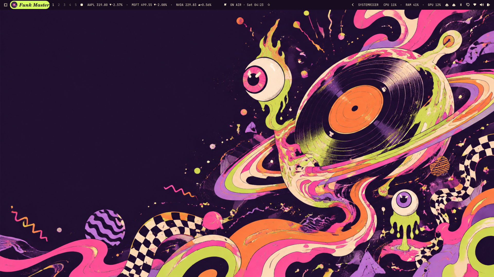

# Omarchy Funk Master

**Cosmic desktop division. Acid lime. Hot pink. Full groove.**

A psychedelic space-funk overhaul for the Lua/Quickshell generation of Omarchy.



## What is included

- Original Cosmic Groove wallpaper: vinyl planet, floating eyes, melting ribbons and checkerboard fragments. Native resolution: 1672 × 941.
- A complete dark palette, used by Omarchy's terminal, editor and utility templates.
- Rounded windows, three-color borders, shadows, light blur and short glide animations.
- Coordinated launcher, menus, notifications, popups, lock input, image picker and authentication colors.
- A taller bar and a C059 italic record badge; click the badge to open the theme picker. The record turns only while hovered.
- Magenta folder icons, ON AIR clock, About branding and native screensaver text.
- Snapshot-based installer and restore command. The old Oligarchy widget/service is disabled; its plugin files remain available.

## Install the complete desktop pack

Requires a running Omarchy Lua/Quickshell session, Python 3.11+, and the installed Yaru-magenta icon family. This was built against Omarchy 4.0.2-1 / Hyprland 0.56.2. Older Waybar/hyprland.conf installations need a port.

From this repository:

```bash
python3 validate.py
python3 install.py install
```

The installer copies theme assets into `~/.config/omarchy/themes/funk-master/`, installs a user-owned bar plugin, merges the bar changes, replaces the two branding text files and applies the theme using `omarchy theme set`. It preserves unrelated widgets, keybindings, monitor settings, notifications and idle timeouts. It restores the prior native screensaver preference when retiring Oligarchy's screensaver service.

Backups live in `~/.local/state/omarchy/funk-master/backups/`. The install validates Hyprland and attempts to restore its snapshot if applying fails. Existing personal look-and-feel overrides load after the theme and may override its styling on other machines.

## Restore the previous desktop

```bash
python3 install.py restore
```

This restores the snapshot from the most recent installation, including the previous theme, wallpaper link, bar configuration, branding, existing Funk Master files (if any), and screensaver toggle. To select an older snapshot:

```bash
python3 install.py restore --backup ~/.local/state/omarchy/funk-master/backups/TIMESTAMP
```

Ordinary theme switching changes theme colors and geometry; the full restore command also removes the extra bar and branding changes. Other apps follow the normal Omarchy theme hooks and may require a new window to display new colors. Native GTK applications receive dark mode and folder icon changes, not a custom replacement of all application chrome.

## Repository layout

Theme files are at the root. `desktop/` contains the optional full-desktop additions. `install.py` installs the complete pack locally without cloning its `.git` into the theme directory. Omarchy's remote theme installer filters Lua from cloned themes, so a remote palette-only installation will not apply the custom window geometry; use the reviewed local installer for the complete pack.

The repository is named `omarchy-Funk-master`; the theme selector name is **Funk Master**. No GitHub remote is required.

## Research and validation

See [design research](docs/design-research.md), [wallpaper prompt and provenance](docs/wallpaper-prompt.md), and [validation report](docs/validation.md).

The checks cover TOML/Lua/QML syntax, primary text contrast, idempotent bar merging and file/symlink restoration. They do not simulate every application that consumes Omarchy's generated themes.
