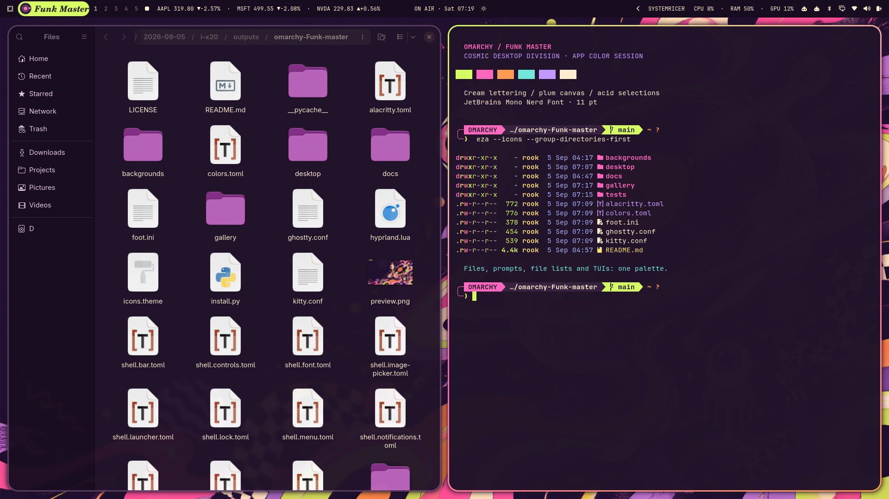

# Funk Master inside your apps



The palette now reaches Files and other GTK apps, terminal lettering, the Bash prompt, file listings, fuzzy search, and LazyGit.

| Surface | Treatment |
| --- | --- |
| Files / GTK 4 | Aubergine content, darker sidebar, raised plum headers and menus, cream labels, lime accents |
| GTK 3 | Matching legacy color definitions and focused widget styles |
| Foot, Kitty, Ghostty, Alacritty | Cream text on aubergine, lime cursor and selection, coordinated sixteen-color palette |
| Terminal typography | Existing installed profiles upgraded to 11 pt; Foot uses JetBrainsMono Nerd Font |
| Bash / Starship | Two-line OMARCHY prompt, pink identity, cream path, lime Git branch, orange Git changes |
| eza / ls | Pink directories, lime executables, mint symlinks, warm and lilac file types |
| fzf | Aubergine panel, plum selection row, lime pointer, pink matches |
| LazyGit | Lime active border, plum selection, mint options, cream text |

## Apply or upgrade

The full installer includes these styles. An existing Funk Master installation can apply only the app upgrade:

```bash
python3 -m unittest discover -s tests -v
python3 validate.py
python3 install.py apps
```

Open a new terminal for the font and shell changes. Restart an already running GTK app to load the CSS. No running terminal sessions are terminated by the installer. Files and Foot were opened and visually checked on the development machine; the other terminal profiles were prepared but their apps were not installed there.

## Theme switching and preservation

GTK colors use libadwaita's [semantic color variables](https://gnome.pages.gitlab.gnome.org/libadwaita/doc/main/css-variables.html). A managed import is added before existing user CSS, which remains intact. An official `theme-set` hook enables the overrides for `funk-master` and empties them for other themes. Already running apps may require a restart after a theme switch.

A managed Bash block loads a small prompt hook. At the next prompt, it follows the selected theme and restores the environment values captured when that shell started. It preserves command exit status for Starship. The existing personal Starship file is left intact: Funk Master selects a separate file through `STARSHIP_CONFIG`. LazyGit merges its original config with the theme using `LG_CONFIG_FILE`; see [LazyGit configuration](https://github.com/jesseduffield/lazygit/blob/master/docs/Config.md) and [Starship configuration](https://starship.rs/config/).

The 11 pt font size remains a readability preference across ordinary theme switches. Full restore reverses it. Sandboxed applications and applications with their own rendering systems may not read host GTK CSS. This does not recolor every Electron or Qt application.

## Restore

```bash
python3 install.py restore
```

New snapshots include the previous GTK CSS, Bash startup file, terminal profiles, app assets and hook, along with the existing desktop snapshot. Restoring a desktop snapshot from before app styling uses the earliest app-aware snapshot to recover the original app files. Keep the backup directory intact for that compatibility path.

## Validation

- Eight Python checks cover palette contrast, installer merging, snapshots, file/symlink restoration, app-file preservation, theme toggling, duplicate font settings and idle-adapter compatibility.
- GTK 3 and GTK 4 CSS parsed without errors through their native CSS providers.
- The installed Foot config passed `foot -C`; the shell hook passed Bash syntax, repeat-source and command-status checks.
- fzf accepted the configured palette; Starship rendered in a new terminal; LazyGit opened with the merged configuration.
- Files 50.2.2 and Foot 1.27.0 were visually checked under the installed theme. The screenshot is an actual desktop capture.
- Hyprland reported no configuration errors after application.
