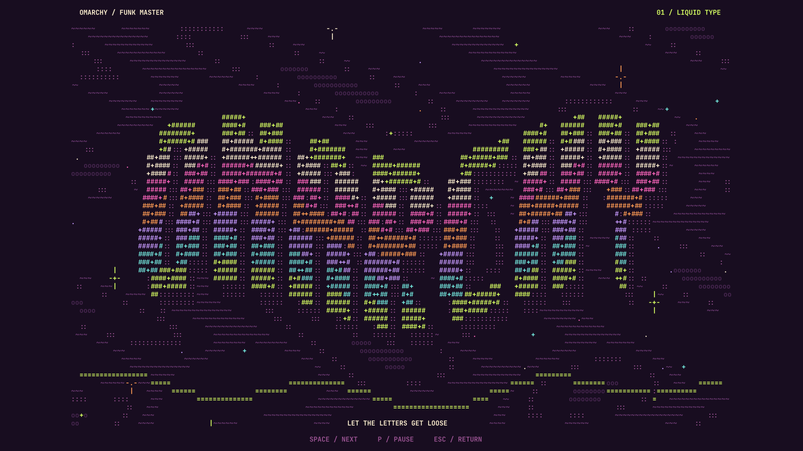
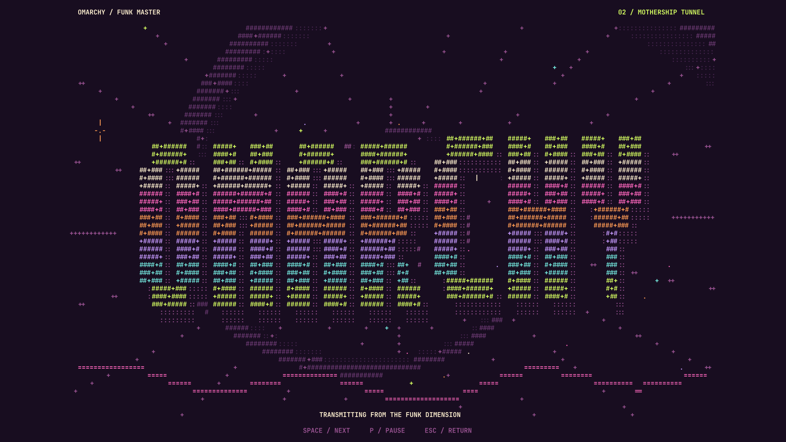
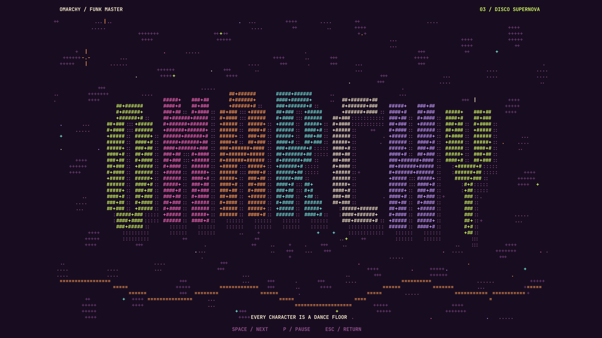
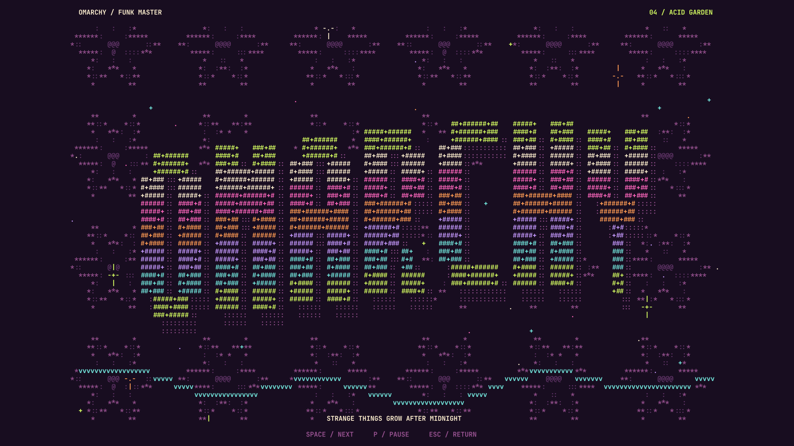

# OMARCHY — after-hours ASCII department

Four original animated screensavers for Funk Master. Every graphic mark is a printable ASCII character. The large OMARCHY wordmark stays present while its letters move through a shifting neon palette.

| Scene | Character choreography |
|---|---|
| **01 · Liquid Type** | The oversized wordmark ripples along a sine wave; liquid contours flow behind it and colored sparks rise around it. |
| **02 · Mothership Tunnel** | A twisting perspective tunnel winds into the center; stars accelerate outward around the floating OMARCHY lettering. |
| **03 · Disco Supernova** | Each letter bounces out of phase and changes ink; rotating radial patterns and expanding sparks fill the space. |
| **04 · Acid Garden** | Rotating ASCII flower contours scroll through the background; the wordmark sways over a dancing green/mint ribbon. |

[Watch the 20-second recording](../gallery/omarchy-ascii-screensavers.mp4).

## Start a preview

**Right-click the Funk Master record badge** in the bar, or run:

```bash
omarchy-shell funk-saver preview
```

| Control | Action |
|---|---|
| Space or Right arrow | Next scene |
| Left arrow | Previous scene |
| 1 / 2 / 3 / 4 | Jump directly to a scene |
| P | Pause or resume |
| Escape or any other ordinary key | Dismiss |
| Mouse movement or click | Dismiss |

Scenes rotate every **18 seconds**, with a **24 FPS** animation timer. Pause freezes the artwork and stops scene rotation. Renderers are destroyed when the screensaver is dismissed.

Command-line controls:

```bash
omarchy-shell funk-saver scene 0  # Liquid Type (indices 0–3)
omarchy-shell funk-saver next
omarchy-shell funk-saver pause
omarchy-shell funk-saver status
omarchy-shell funk-saver dismiss
```

## Automatic activation

The installer creates a user-owned clone of Omarchy's idle plugin using `omarchy plugin clone omarchy.idle`. A narrow adapter substitutes the ASCII service for the native screensaver launch. Upstream idle timers, lock command, inhibitors, and Stay Awake behavior are retained; the original packaged files are untouched. The adapter checks exact source anchors and refuses an incompatible upstream revision.

On the installation used for validation, screensaver delay is **150 seconds** and lock delay is **300 seconds**. **Stay Awake was already enabled and remains enabled**, so automatic activation is currently paused. Right-click previews work regardless. To enable the normal idle schedule when desired:

```bash
omarchy-shell idle enable
```

To keep the machine awake again:

```bash
omarchy-shell idle disable
```

The screensaver respects Omarchy's separate `screensaver-off` toggle for automatic launches. A manual preview can still be shown. The animation is a screensaver; the existing Omarchy lock service handles authentication. It closes before the scheduled lock and will not open over a locked session.

## Install or restore

Existing Funk Master installations can upgrade with:

```bash
python3 install.py screensavers
```

New installations using `python3 install.py install` include the screensavers. The installer saves the theme, bar, plugin, idle-clone and screensaver-toggle state, then restarts the shell once to load fresh plugin code. It leaves the user's Stay Awake preference intact.

```bash
python3 install.py restore
```

Restore uses the most recent snapshot. On this machine, that snapshot is the Funk Master desktop immediately before the animated screensavers were added. Older snapshots remain available for restoring earlier setups.

## Validation

- All four scenes verified at 48×28, 80×40, 160×56, and 180×76 character grids.
- All frame output is printable ASCII; each scene includes OMARCHY and produces distinct animated frames.
- Renderer generation averaged approximately **1 ms/frame** over 240 frames at 160×56 characters. This measures JavaScript generation, not total GPU/CPU power use.
- Screen recording captured **1280×720 H.264 at 24 FPS**. The recorder's observed updates were approximately 24–25 per second.
- Live keyboard tests passed for Space, pause/resume and Escape; screenshots inspected for all four scenes.
- Automatic 18-second scene rotation checked in a live preview.
- Idle-flow tests execute the adapter's actual JavaScript functions with process/timer doubles: starting a saver arms the existing lock timer; overlay mapping does not cancel it; the lock path closes the saver and invokes the native lock command; locked/disabled launch gating works.
- Source compatibility and adapter idempotence tests passed, as did the existing four desktop validation tests.
- The final service loaded with `screensaverEnabled: true`; Hyprland reported no configuration errors.

Automatic physical inactivity and authentication were not exercised end-to-end because the existing Stay Awake preference was preserved. Mouse dismissal and simultaneous multi-monitor rendering are implemented but were not tested through physical input or a second active display. This desktop had one active screen.

Run checks from the repository:

```bash
python3 validate.py
python3 tests/test_idle_adapter.py
node tests/ascii-engine.test.cjs
python3 desktop/adapt_idle.py /usr/share/omarchy/shell/plugins/services/idle/Service.qml | node tests/idle-flow.test.cjs
```

## Scene gallery





